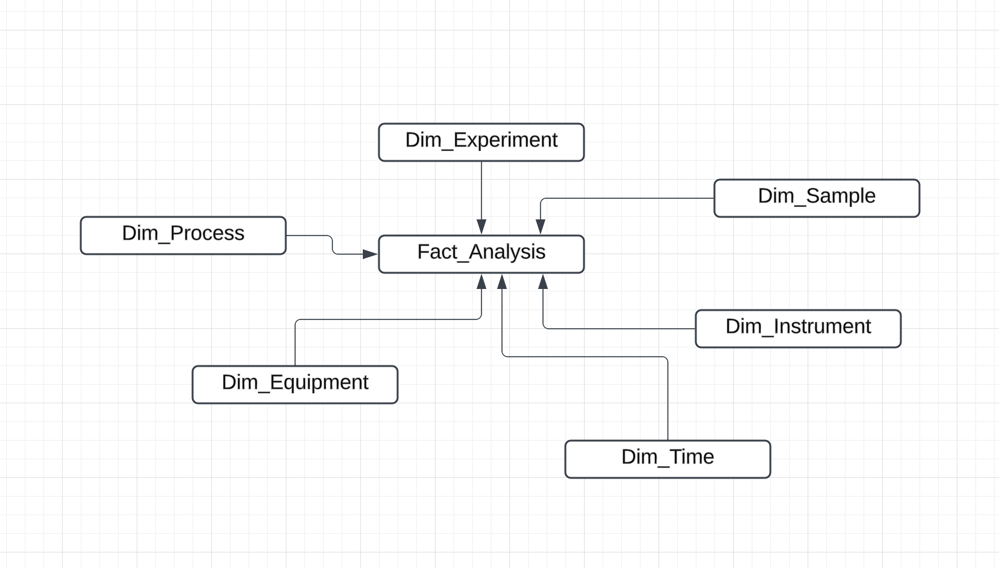
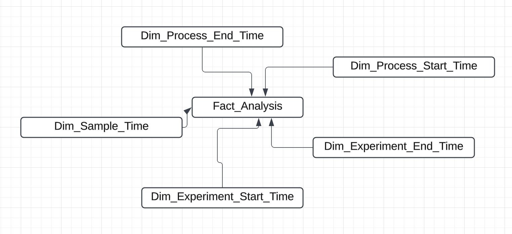

# Heirloom Take Home Exercise

### Design Decisions

1. Classic Kimball dimensional model, star schema, for the data model.
2. Snowflake data platform for the database/data warehouse

### Entity Relationship Diagram

I have 6 dimensions and 1 fact, listed below

Dimension Tables

	1.	Dim_Experiment: Details about experiments conducted by scientists.
	2.	Dim_Process: Information about the processes, including types and parameters.
	3.	Dim_Equipment: Information about the equipment used in the processes.
	4.	Dim_Sample: Details about the samples collected during the processes.
	5.	Dim_Instrument: Information about laboratory instruments, including calibration details.
    6.	Dim_Time: Time-related attributes experiment, process and sample related timestamps

Fact Table

	•	Fact_Analysis: Stores quantitative data, such as results of analyses and foreign key relationships to the dimensions.

### DDL

Please see the [ddl file](scripts/ddl.sql) for the SQL script to create the dimensions and fact table

### Design Considerations & Assumptions
    Snowflake 
        •	Snowflake is a great database for OLAP style analytic workloads
	    •	Snowflake has great semi-structured data capabilities (VARIANT) for flexible storage of parameters and results.
        •	Snowflake separates storage and compute,
            meaning you can store as much data as possible for dirt cheap, while building a great data model
            to ensure analysis while minimizing compute costs

	Dimensional Model
        •	Fact table is optimized for aggregations and analysis.
        •	Dimensions provide descriptive context for easy querying.
        •	Star schema minimizes joins between tables as scientists query the data for analysis
        •	Created a Dim Time table for further analysis of timestamp fields
        •	The Dim Time Table can also be used for Role Playing Dimensions (See Image Below)

    Analysis Data
        •	Grain (granularity) of data is at the sample level, one record per sample 
        •	Results field is of the VARIANT data type,
            to enable multiple result items 
            including structure mass measurements or unstructured image files,
            stored as file paths in a cloud storage service like s3

### Role Playing Dimensions

### SQL queries that would answer the following questions:

#### 1. In the above example, how did the carbon content trend from one process to the next?

_Here's the [sql query](scripts/carbon_content_trend.sql) that shows the carbon content of the different processes,
trending over time_

#### 2. Can the data from the combustion analyzer be trusted? (i.e., when was it last calibrated?)

_Here's the [sql query](scripts/instrument_trustworthiness_check.sql) that shows whether an instrument can be trusted._

_I'm using a basic assumption that if it's been less than 4 days between analysis and instrument calibration,
then we can trust the instrument. If not, then the instrument isn't trustworthy._

_For a slighty more complicated analysis, we can assign a trustworthiness score to each instrument based on the difference
in days between the analysis date and calibration date._
    

